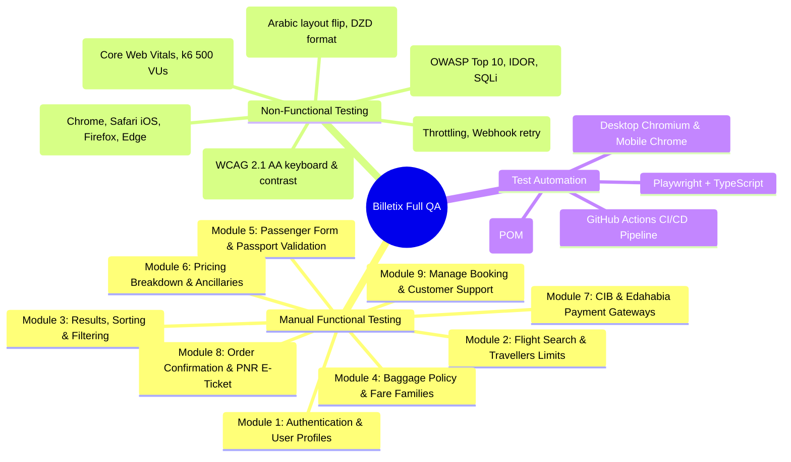

# Billetix QA & Test Automation Framework

Enterprise-grade **Full Quality Assurance (QA) Strategy & Playwright + TypeScript** end-to-end (E2E) test automation suite for the **Billetix** flight booking platform ([billetix.dz](https://billetix.dz/)).

Developed with the **Page Object Model (POM)** architecture, **Data-Driven Testing (DDT)**, and CI/CD readiness.

---

## Target Platform: Billetix Algeria
- **URL:** [https://billetix.dz](https://billetix.dz/)
- **Platform Type:** B2C Online Travel Agency (OTA) & Flight Booking Engine
- **Target Market:** Domestic & International flights from Algeria (Algiers, Oran, Constantine, Paris, Istanbul, etc.)
- **Operating Entity:** SARL BILLETIX ALGERIE TRAVEL
- **Currency & Localization:** Algerian Dinar (DZD), Multilingual (English, French, Arabic RTL)

---

## Dedicated QA Documentation Links

For deep-dive testing artifacts and detailed test cases, consult the dedicated documentation:

| Document | Description | Link |
| :--- | :--- | :---: |
| **5-Day Master Plan** | 5-Day Industrial QA & Test Automation Master Execution Plan | [Read Plan](docs/5_DAY_INDUSTRIAL_TEST_PLAN.md) |
| **Manual Test Plan** | 40+ Step-by-Step test cases across 9 modules (Auth, Search, Booking, Payment, E-Ticket) | [Read Plan](docs/MANUAL_TEST_PLAN.md) |
| **Non-Functional Plan** | Performance (Lighthouse/k6), Security (OWASP Top 10), Arabic RTL, WCAG 2.1 AA a11y | [Read Plan](docs/NON_FUNCTIONAL_TEST_PLAN.md) |
| **Defect Management** | Bug report template, Severity/Priority matrix, Bug lifecycle, QA release sign-off | [Read Guide](docs/DEFECT_MANAGEMENT.md) |

---

## Full QA Scope & Coverage



---

## 1. Manual Testing Plan Summary

The manual testing strategy covers **9 core functional modules** detailed in [docs/MANUAL_TEST_PLAN.md](docs/MANUAL_TEST_PLAN.md):

| Module | Scope & Critical Paths | High-Risk Validation |
| :--- | :--- | :--- |
| **1. Auth & Profiles** | B2C Registration, Login, Forgot Password, B2B Agent portal link | Duplicate email rejection, session persistence after reload |
| **2. Search Widget** | One-Way, Round-Trip, Multi-City, Airport autocomplete | Same origin/destination rejection, Infants count <= Adults count |
| **3. Results & Filter** | Flight cards, Cheapest/Fastest sort, Stops & Airline filters | Correct ascending price ordering, Zero search results state |
| **4. Fare Families** | Saver vs Flex tiers, baggage allowance modal | Checked baggage (23kg) & Cabin baggage (7kg) policy transparency |
| **5. Passenger Form** | Name validation, Adult (>= 12y), Child (2-12y), Infant (< 2y) | Passport 6-month expiry check, Special characters rejection |
| **6. Pricing Summary** | Base Fare + Taxes + Surcharges = Total DZD | Baggage/Seat add-on recalculation, Promo code validation |
| **7. Payment Gateways** | SATIM CIB, Algerie Poste Edahabia cards, OTP verification | Double-click charge prevention, Gateway cancellation recovery |
| **8. Order & Tickets** | 6-character PNR generation, Booking Reference, PDF Ticket | Valid QR code / Barcode on E-Ticket, Automated email dispatch |
| **9. Manage Booking** | Retrieve itinerary by PNR + Last Name, Support channels | Invalid PNR error notification, Support phone/email integration |

---

## 2. Non-Functional Testing (NFT) Plan Summary

Detailed test parameters and benchmarks are available in [docs/NON_FUNCTIONAL_TEST_PLAN.md](docs/NON_FUNCTIONAL_TEST_PLAN.md):

### A. Performance & Core Web Vitals
- **LCP (Largest Contentful Paint):** <= 2.0s on Desktop, <= 2.8s on Mobile 4G.
- **FID / INP:** <= 100ms for airport search autocomplete.
- **CLS (Cumulative Layout Shift):** <= 0.05 to prevent accidental clicks on flight cards.
- **Load Testing (k6 / JMeter):** 500 concurrent Virtual Users (VUs) sustaining search queries during holiday peaks with < 1% error rate.

### B. Security & Vulnerability Assessment (OWASP Top 10)
- **SQL / NoSQL Injection:** Parameterized query audit on airport search inputs and PNR lookups.
- **Cross-Site Scripting (XSS):** Input sanitization on passenger names and special notes.
- **IDOR / BOLA:** Verification that booking URLs (`/booking/confirmation?pnr=...`) cannot be viewed across unauthorized sessions.
- **Price Manipulation:** Server-side price recalculation preventing client-side total tampering.
- **PCI-DSS Compliance:** Zero storage of raw card numbers or CVVs in browser LocalStorage/cookies.

### C. Arabic RTL & Localization Testing
- **RTL Layout:** `dir="rtl"` alignment, flight direction arrows reversed, drawer slide from right, calendar column inversion.
- **Currency Display:** Consistent Algerian Dinar formatting (**`DZD`** or **`د.ج`**) with thousands separators.

### D. Cross-Browser & Device Compatibility
- **Desktop:** Chrome (Win 11), Edge, Safari (macOS), Firefox.
- **Mobile & Tablet:** iPhone 14/15 Safari (iOS 17), Android 14 Chrome (Pixel/Galaxy), iPadOS.

### E. Accessibility (WCAG 2.1 AA)
- Minimum color contrast ratio 4.5:1 on brand buttons.
- Full keyboard navigation (Tab, Enter, Escape) across modal sheets and search filters.

---

## 3. Test Automation Framework (Playwright + TypeScript)

### Tech Stack
| Component | Tool / Technology |
| :--- | :--- |
| **Runner** | [Playwright Test](https://playwright.dev/) |
| **Language** | [TypeScript](https://www.typescriptlang.org/) (Strict mode) |
| **Architecture** | Page Object Model (POM) |
| **Projects** | Desktop Chromium + Mobile Chrome (Pixel 7) |
| **CI/CD** | GitHub Actions (`.github/workflows/playwright.yml`) |

### Repository Structure
```
billetix_automation/
├── .github/
│   └── workflows/
│       └── playwright.yml                # CI/CD Automated Test Pipeline
├── docs/
│   ├── 5_DAY_INDUSTRIAL_TEST_PLAN.md    # 5-Day Master Execution Roadmap
│   ├── MANUAL_TEST_PLAN.md              # 40+ Step-by-Step Manual Test Cases
│   ├── NON_FUNCTIONAL_TEST_PLAN.md      # Performance, Security, RTL, a11y Plan
│   └── DEFECT_MANAGEMENT.md             # Bug template, Severity matrix, Sign-off
├── data/
│   ├── airportsData.json                # Domestic (ALG, ORN, CZL) & Intl (CDG, IST) fixtures
│   ├── passengerData.json               # Passenger profiles, DOBs, passport fixtures
│   └── flightSearchData.json            # Search route combinations
├── pages/
│   ├── BasePage.ts                      # Navigation, logo, currency, B2B link helpers
│   ├── HomePage.ts                      # Flight search widget & responsive travellers sheet
│   ├── FlightSearchResultsPage.ts       # Search results list, sorting, and airline filters
│   ├── CheckoutPage.ts                  # Passenger inputs, coupon, and pricing summary
│   ├── AuthPage.ts                      # Login and Registration modals
│   └── SupportPage.ts                   # Contact form and FAQ accordion helpers
├── tests/
│   ├── 01-home-and-navigation.spec.ts   # Title, logo, DZD currency, B2B link, trust badges
│   ├── 01-ui-components-baseline.spec.ts # Header, Footer, PCI-DSS badges, dead-links, responsive
│   ├── 02-flight-search.spec.ts         # Journey radio toggle, infants constraint, inputs
│   ├── 03-search-results-filter.spec.ts # Flight listing, sorting, DZD currency, responsive
│   ├── 04-auth-and-passenger-validation.spec.ts # Login modal, Google OAuth, register, password mismatch
│   ├── 05-arabic-rtl-localization.spec.ts       # RTL switcher, DZD currency, Algerian address, legal badges
│   ├── 06-accessibility-audit.spec.ts           # Automated WCAG 2.1 AA Axe-core accessibility audit
│   ├── 07-passenger-checkout-flow.spec.ts       # Flight selection to checkout, passenger inputs, pricing
│   └── 08-support-and-policies.spec.ts          # Contact Us form, FAQ accordion toggle, terms/privacy/refund
├── utils/
│   ├── testHelper.ts                    # Dynamic emails, Algerian phones, passport generators
│   └── dateHelper.ts                    # Dynamic future departure/return date formatters
├── playwright.config.ts                 # Multi-browser configs, reporting, traces
├── package.json
└── README.md
```

---

## Automated Test Verification Status

All **70 tests passed** across Desktop Chromium and Mobile Chrome viewports:

```
Running 70 tests using 2 workers

  - [chromium]      : 35 tests PASSED (100%)
  - [mobile-chrome] : 35 tests PASSED (100%)

70 passed (3.4m) - 100% Success Rate
```

---

## Execution & Command Reference

```bash
# 1. Install dependencies
npm install

# 2. Run all automated tests (Desktop Chromium + Mobile Chrome)
npm test

# 3. Run in headed browser mode
npm run test:headed

# 4. Run interactive Playwright UI mode
npm run test:ui

# 5. Run specific test suite
npx playwright test tests/01-ui-components-baseline.spec.ts

# 6. View HTML Test Execution Report
npm run report
```
