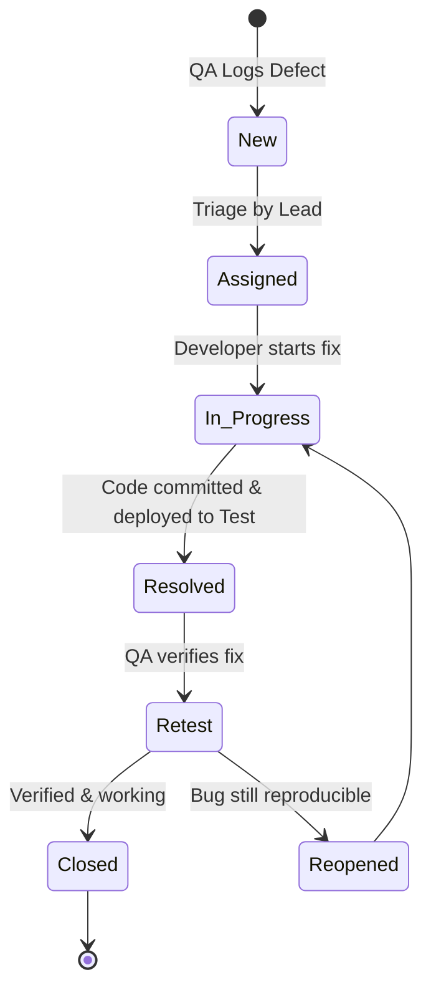

# Billetix Defect Management & QA Sign-Off Guidelines 🐞📑

This document outlines the standard defect reporting format, severity/priority definitions, bug lifecycle, and QA release sign-off criteria for **Billetix** ([https://billetix.dz](https://billetix.dz/)).

---

## 1. Defect Severity & Priority Matrix

| Level | Severity (Impact on System) | Priority (Urgency to Fix) | Example in Billetix |
| :--- | :--- | :--- | :--- |
| **S1 / Critical** | System crash, data loss, payment failure, PNR not generated after payment, security vulnerability. | **P1 (Immediate)** — Fix within 4 hours; blocks release. | User charged on CIB card, but no PNR generated and booking status stays "Failed". |
| **S2 / High** | Major feature broken with no workaround; incorrect price calculation in DZD; traveller constraint bypass. | **P2 (Urgent)** — Fix within 24 hours. | User can add 3 infants for 1 adult, causing airline booking rejection downstream. |
| **S3 / Medium** | Minor feature issue or edge case with an available workaround; filter malfunction. | **P3 (Normal)** — Fix within current sprint. | "Cheapest First" sort occasionally puts 1 flight card out of order. |
| **S4 / Low** | Cosmetic, minor text typo, minor alignment flaw in Arabic RTL that doesn't break booking. | **P4 (Low)** — Fix when time permits. | Spelling typo in footer FAQ or 2px padding misalignment on tablet. |

---

## 2. Standard Bug Report Template (Markdown)

```markdown
**Defect ID:** BUG-BLX-[Module]-[Number] (e.g. BUG-BLX-PAY-003)
**Title:** [Module] Short, descriptive summary of the defect
**Severity:** Critical / High / Medium / Low
**Priority:** P1 / P2 / P3 / P4
**Reporter:** [QA Engineer Name]
**Assigned To:** [Developer Name]
**Environment:**
- URL: https://billetix.dz/...
- Browser: Google Chrome v124 (Desktop) / Safari iOS 17 (Mobile)
- OS: Windows 11 / iOS 17
- Screen Resolution: 1920x1080 / 390x844

**Pre-conditions:**
- User logged in as test user OR guest user
- Flight search executed for route Algiers (ALG) -> Paris (CDG)

**Steps to Reproduce:**
1. Navigate to https://billetix.dz
2. Select 1 Adult, Economy, Route: ALG to CDG
3. Select any flight and proceed to Passenger Information form
4. In Passenger Name field, enter special characters: "Karim@#$123"
5. Click "Proceed to Checkout"

**Expected Result:**
Inline validation error: "Names must contain letters only matching passport" should appear; submission blocked.

**Actual Result:**
Form accepts the name with symbols and submits payload to backend, resulting in HTTP 500 GDS parsing error.

**Visual Evidence / Attachments:**
- Screenshot: `screenshots/BUG-BLX-PAY-003.png`
- Console Error Logs: `TypeError: unhandled exception in gds_formatter`
- Network Payload: Request body containing `"firstName": "Karim@#$123"`
```

---

## 3. Defect Lifecycle Workflow



---

## 4. QA Release Sign-Off Criteria (Definition of Done)

A software build is eligible for Production Deployment when ALL criteria are satisfied:
1. **Zero S1 (Critical) & Zero S2 (High) open defects.**
2. **100% of P1 & P2 automated Playwright tests passing** across Desktop & Mobile projects.
3. **Core booking workflow verified end-to-end** on live payment sandbox / staging.
4. **Security audit clean:** No OWASP Top 10 vulnerabilities (IDOR, XSS, SQLi, payment tampering).
5. **Cross-browser signed off:** Verified on Chrome, Edge, Safari iOS, and Android Chrome.
6. **Arabic RTL layout signed off:** No broken text alignment or flipped layout bugs.
